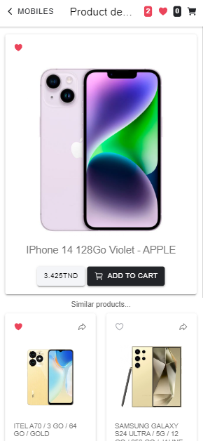

### Frontend (Ionic-React) Setup
Navigate to the frontend directory:

   >cd ../frontend

¤ Install dependencies:

  >npm install

¤ Start the Ionic server:
  
  >ionic serve

### Backend (Springboot) Setup
Run a sql server ( like: wamp)
Run the project

## Interfaces

### Market Screen

### Products Screen

### Product Screen

### Favorites Screen

### Shop Screen

### Profile Screen

### SignIn Screens

### Add Seller Screen

### Add product Screen

### Admin space Screen

